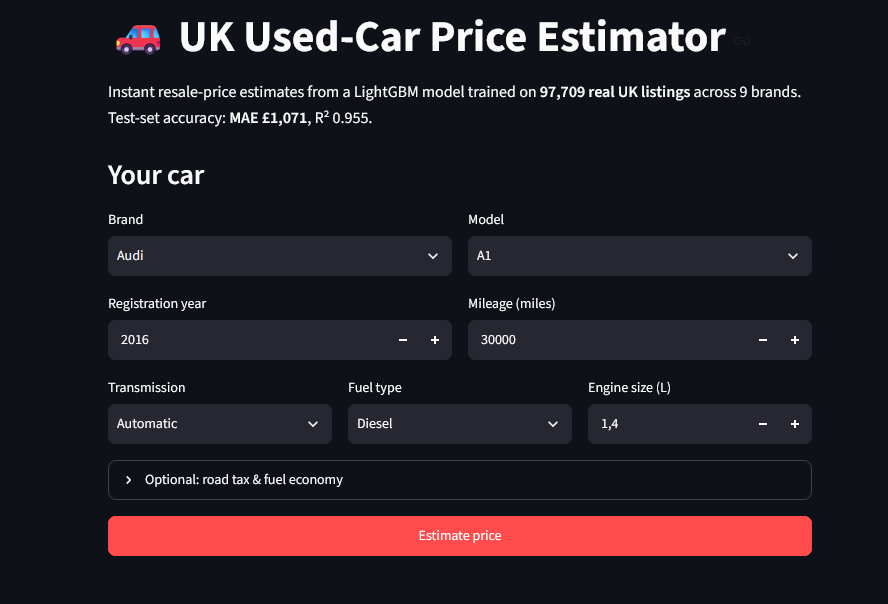
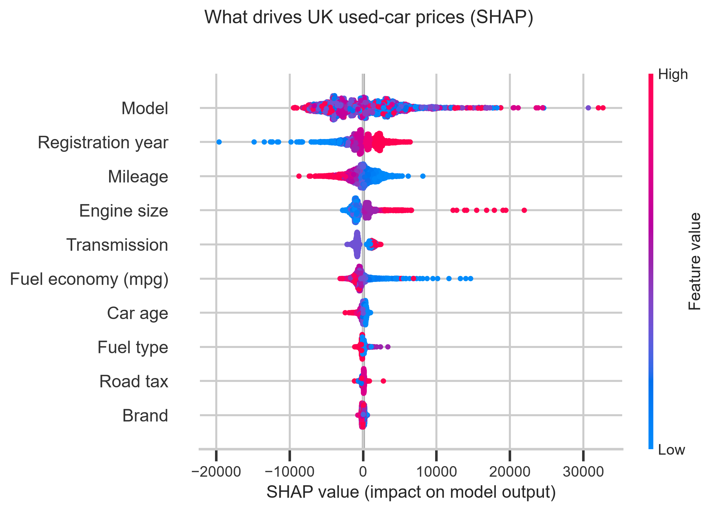

# 🚗 UK Used-Car Price Estimator

**A deployed, interactive ML product — not a notebook.** Enter your car's
details and get an instant resale estimate with an honest uncertainty range
and a per-car explanation of *why*. Trained on **97,709 real UK used-car
listings** (~99k raw) across 9 brands.

> **Test-set accuracy: MAE £1,071 · R² 0.955** — a 52% error reduction over a
> tuned linear baseline.

## 🔴 Live Demo

**👉 [Try the live app](https://uk-used-car-price-estimator-g2phpxcgiruvdwahjiirso.streamlit.app/)**




Pick a brand → the model dropdown filters to that brand → enter year,
mileage, transmission, fuel and engine size → get
**"£9,800 (likely £8,700 – £9,900)"** plus a SHAP chart showing exactly which
details pushed the price up or down.

## Why this project is different

Most "predict car price" repos train on one pre-cleaned CSV and stop at a
metrics cell. This one is built like a product:

1. **Real data engineering** — 13 files with inconsistent schemas and a raw
   scraped feed are merged and cleaned with every action logged.
2. **A single unified model** across all brands, with quantified uncertainty.
3. **Explainability in the UI**, not just a notebook figure.
4. **One-click deployment** to Streamlit Community Cloud (free tier).

## 🧹 Data honesty (the messy parts, on purpose)

Surfacing data problems is a feature of this repo, not something hidden in a
notebook cell:

| Issue in the raw data | How it's handled |
|---|---|
| `hyundi.csv` names its tax column **`tax(£)`**; the other 8 brands use `tax` | Renamed during merge (`data_processor.load_brand_file`), logged |
| No brand column exists — brand is implicit in the **filename** | A `brand` column is created from each file's origin; it becomes the app's first input and a top predictive feature |
| `cclass.csv` / `focus.csv` have **no `tax`/`mpg`** | If folded in, columns are added as `NaN` + a `was_missing_tax_mpg` indicator. **Default: excluded** — they duplicate listings already inside `merc.csv`/`ford.csv`, so including them would leak duplicates across train/test |
| Raw scraped files (`unclean_*.csv`): prices like `" £8,000"`, comma numbers (`"38,852"`), values split across duplicate columns (`mileage` empty, real value in `mileage2`), engine sizes like `0.999` | `clean_raw_listing()` parses one raw row into the clean schema — a working "from raw scrape to model-ready" demo run at the end of the merge |
| **`engineSize == 0`** (273 listings) — missing encoded as zero | Set to `NaN`; LightGBM handles missing values natively |
| Implausible years (e.g. 2060 typos) | Dropped with per-rule counts logged |
| Leading whitespace in every `model` value (`" A1"`) | Stripped (99,183 values) |
| 1,475 exact duplicate listings | Dropped before splitting |

## 🏗 Architecture

```
data/raw (13 CSVs)
   │  merge + schema reconciliation + cleaning        src/data_processor.py
   ▼
data/processed/cars_clean.parquet  (97,709 × 11)
   │  car_age, native categorical dtypes, EDA panel   src/features.py
   ▼
unified LightGBM regressor (brand = feature)          src/model.py, train.py
   ├─ point model (L1 objective, early stopping)
   └─ p10 / p50 / p90 quantile models → prediction interval
   │
   ▼
SHAP (global beeswarm + per-prediction breakdown)     src/explainability.py
   ▼
Streamlit UI (cached model, filtered dropdowns)       app/app.py
   ▼
Streamlit Community Cloud (app/app.py, free tier)
```

**Why one unified model instead of nine per-brand models?** Depreciation
curves (age, mileage) are largely shared across brands, so low-volume brands
— Hyundai has 4.8k listings vs Ford's 17.8k — borrow statistical strength
from the pooled data instead of overfitting their own small sample. LightGBM
learns brand-specific corrections through the `brand`/`model` categorical
splits anyway. One artefact is also simpler to version, explain and deploy.

## 📊 Results (held-out test set, n = 14,657)

| Model | MAE | RMSE | MAPE | R² |
|---|---:|---:|---:|---:|
| Median baseline | £6,770 | £10,013 | 46.4% | −0.055 |
| Ridge regression (one-hot) | £2,249 | £3,728 | 17.3% | 0.854 |
| **LightGBM (unified)** | **£1,071** | **£2,072** | **6.6%** | **0.955** |

**Uncertainty:** the p10–p90 interval averages £3,052 wide with **71.9%
empirical coverage** (nominal 80%). Quantile models trained independently
under-cover slightly — an honest, documented gap; conformal calibration is
the listed next step.

**Top price drivers (SHAP, global):** `model`, `engineSize`, `car_age`/`year`,
`mileage`, `brand` — see `reports/figures/shap_summary.png`.



## 🚀 Installation & local run

```bash
git clone https://github.com/MelihOrel/uk-used-car-price-estimator.git
cd uk-used-car-price-estimator
pip install -r requirements.txt

# 1) train (merges & cleans the CSVs, trains 4 LightGBM models, ~3 min)
python train.py

# 2) launch the app
streamlit run app/app.py
```

Pipeline stages can also be run individually:
`python -m src.data_processor` (merge + clean) and
`python -m src.features` (EDA panel).

## 🖱 Usage (app flow)

1. **Brand** dropdown → **Model** dropdown filters to that brand's models.
2. Enter **year, mileage, transmission, fuel type, engine size** (road tax
   and mpg are optional — sensible per-model medians are pre-filled).
3. Press **Estimate price** →
   - the point estimate (e.g. **£9,800**),
   - the likely range (**£8,700 – £9,900**, p10–p90),
   - a SHAP bar chart: *"Mileage = 30,000 → −£779; Model = Fiesta →
     −£4,060"* — which details raised or lowered *your* estimate.
4. Out-of-range inputs (200k+ miles, 20+ year-old cars) trigger explicit
   caution banners instead of silently extrapolating.

## ☁️ Deploying to Streamlit Community Cloud (free)

The app is deployed on [Streamlit Community Cloud](https://streamlit.io/cloud),
which runs Streamlit apps straight from a GitHub repo for free.

1. Push this repo to GitHub (the trained `models/` folder must be included —
   the app loads artefacts, it does not retrain).
2. Sign in at <https://share.streamlit.io> with your GitHub account.
3. **Create app** → pick this repo, branch `main`, main file path
   **`app/app.py`** → Deploy.
4. Copy the assigned `*.streamlit.app` URL into the **Live Demo** section above.

> Free-tier notes: ~1 GB RAM (this model is 20 MB, well within limits) and the
> app sleeps after 12 quiet hours, waking in a few seconds on the next visit.

## ⚠️ Limitations

- **UK market, prices in £**, listings roughly 1996–2020: the model encodes
  **2020 market conditions** and receives no live updates — post-2020
  inflation and the EV shift are not reflected.
- Listing price ≠ final sale price; condition, service history, colour and
  region are absent from the data.
- Interval coverage is 72% vs the 80% nominal (see Results).
- Rare configurations get wider, less reliable estimates.

## 📁 Project structure

```
uk-used-car-price-estimator/
├── app.py                     # optional entry point (runs app/app.py)
├── train.py                   # end-to-end training pipeline
├── config.yaml                # paths, features, hyperparameters
├── requirements.txt
├── app/
│   └── app.py                 # Streamlit UI
├── src/
│   ├── data_processor.py      # merge, schema reconciliation, cleaning
│   ├── features.py            # car_age, categorical dtypes, EDA panel
│   ├── model.py               # LightGBM point + quantile models, baselines
│   └── explainability.py      # SHAP global + per-prediction
├── data/
│   ├── raw/                   # 13 source CSVs
│   └── processed/             # cars_clean.parquet
├── models/                    # price_model.joblib, metrics.json, metadata.json
└── reports/figures/           # eda_panel.png, shap_summary.png
```

## License & data

Data: [100,000 UK Used Car Data Set](https://www.kaggle.com/datasets/adityadesai13/used-car-dataset-ford-and-mercedes)
(Kaggle, scraped 2020). Code: MIT.
